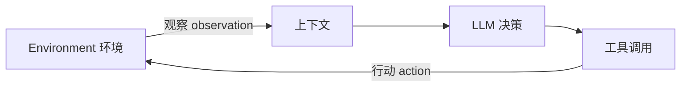

# 第一章 · AI Agent 入门 · 复习笔记

> 🎯 一句话记住本章：**Agent = 大脑 + 眼睛 + 手脚**，而 Harness 是让这套组合「从能做 → 可靠地做」的缰绳。
> ⏱️ 通读约 12 分钟 · 考前速览约 3 分钟
> 📚 来源：`../ai-agent-book/book/chapter1.md`
> 🔁 用法：先看「30 秒地图」建立骨架；复习时直接看「考前回忆卡」；忘细节再回正文；最后用「复习自测」查漏。

## 🗺️ 30 秒地图

| 想记住的 | 一句话 | 忘了先想 |
| --- | --- | --- |
| Agent 最小公式 | `Agent = LLM + 上下文 + 工具` | 大脑 + 眼睛 + 手脚 |
| 边界 | 公式只描述 Agent 内部 | Environment 在边界外 |
| ReAct 循环 | `想 → 做 → 看` | 每步把结果追加进轨迹 |
| 上下文 | `静态前缀 + 轨迹` | 系统提示词、工具定义是静态；消息/回复/结果是轨迹 |
| 工具 | 感知、执行、协作、事件、沟通 | 手脚能做什么 |
| Harness | Agent 内、模型外的治理层 | 上下文管理 + 工具接口 + 约束 + 验证 + 纠正 |
| 编排顺序 | 单次调用 → 工作流 → 自主 Agent | 能简单就不要复杂 |
| 安全 | 上下文层 → 执行层 → 数据层 | 越靠下越不依赖模型 |

## ⚡ 考前回忆卡（最该背的 7 句）

1. `Agent = LLM + 上下文 + 工具`，也就是「大脑 + 眼睛 + 手脚」。
2. 这个公式只描述 Agent 内部；Environment 在边界之外，Agent 只能通过「观察接口 + 行动接口」和环境交互。
3. ReAct = Reasoning + Acting，实际循环是 `想 → 做 → 看`。
4. 上下文 = 静态前缀（系统提示词 + 工具定义）+ 轨迹（用户消息 + 模型回复 + 工具执行结果）。
5. 工具调用四步：声明 → 模型决定 → 执行并把结果追加回上下文 → 模型决定下一步。
6. Harness = 上下文管理 + 工具接口 + 约束 + 验证 + 纠正，位于「Agent 边界内、Model 之外」。
7. 安全三层护栏：上下文层管「能看到什么」，执行层管「能做什么」，数据层管「世界最终被改成什么」。

---

## 0. 本章要解决什么问题

带着这些问题读，读完能用自己的话回答，就说明过关了：

- Agent 的最小工程结构是什么？
- Agent 与 Environment 的边界在哪里？
- ReAct 循环如何把 LLM、上下文、工具串起来？
- 为什么 Harness 是生产级 Agent 的核心竞争力？
- 什么时候用工作流，什么时候用自主 Agent？
- 安全护栏的三层分别管什么？

---

## 1. 核心公式与边界

### 1.1 最小工程公式

```text
Agent = LLM + 上下文 + 工具
```

更直观地记：

```text
Agent = 大脑 + 眼睛 + 手脚
```

- **LLM = 大脑**：负责理解和决策。
- **上下文 = 眼睛**：决定 Agent 能看到什么。
- **工具 = 手脚**：决定 Agent 能做什么。

> 💡 类比：一个人再聪明（LLM），如果看不见（上下文）或没手脚（工具），也完成不了外部任务。

### 1.2 这个公式只描述 Agent 内部



- 公式只描述 Agent 边界之内，不包含 Environment。
- Agent 只能通过**观察接口**和**行动接口**与环境交互。

Environment 包括：

- 文件
- 数据库
- 网页
- 用户
- 其他 Agent
- 物理世界或仿真世界

> 🧠 记法：边界内 = 公式；边界外 = Environment。判断一个东西属不属于 Agent，先问「它是模型、上下文，还是工具？」，都不是就大概率在环境里。

---

## 2. 三大组件详解

### 2.1 LLM：Agent 的大脑

LLM 是决策核心，负责：

- 解析用户真实意图。
- 把模糊任务拆成步骤。
- 决定下一步做什么、要不要调用工具、调用哪个工具、传什么参数。

关键能力：

- **内部思考**：在真正行动前先规划、推演，不改变外部环境。
- **预训练**：获得语言能力和世界知识。
- **后训练**：把工具调用、长程规划等决策策略内化为原生能力。

### 2.2 模型即 Agent

- 先进模型已经把「何时调用工具、调哪个、传什么参数」内化。
- 但这不意味着框架不重要。
- 模型越强，出错影响越大，Harness 越关键。

> 💡 Harness 的原意是「马具」：模型像一匹强大但不可预测的马，Harness 像缰绳和挽具，把力量引导到正确方向。

### 2.3 Agent 的三条学习路径

| 路径 | 更新位置 | 时间尺度 | 特点 |
| --- | --- | --- | --- |
| 上下文适应 | 当前任务内 | 即时 | 快速、低成本，但不跨任务保存 |
| 外部产物更新 | 知识文档、Prompt/Skill、程序/Harness | 跨任务 | 可审计、可修订、可控积累 |
| 参数更新 | 模型权重 | 训练周期 | 成本高、泛化强，能内化难以显式表达的能力 |

三条路径不是互斥，而是不同时间尺度上的协同机制。

### 2.4 上下文：Agent 的眼睛

每次调用 LLM 时，上下文由五部分组成：

| 部分 | 作用 | 属于 |
| --- | --- | --- |
| 系统提示词 | Agent 的身份、权限、行为准则 | 静态前缀 |
| 工具定义 | 可用工具的名称、功能、参数格式 | 静态前缀 |
| 用户消息 | 用户输入，可能包含 RAG 检索的外部知识 | 动态轨迹 |
| 模型回复 | `reasoning` + `content` + `tool_calls` | 动态轨迹 |
| 工具执行结果 | 工具返回的观察 | 动态轨迹 |

核心公式：

```text
上下文 = 静态前缀 + 轨迹
静态前缀 = 系统提示词 + 工具定义
轨迹 = 用户消息 + 模型回复 + 工具执行结果
```

### 2.5 消融实验 1-1：上下文组件并不等价

| 去掉什么 | 会发生什么 |
| --- | --- |
| 工具定义 | 失去行动能力，但模型可能仍然「自信地编造答案」 |
| 工具执行结果 | 闭环断裂，Agent 会盲目重试 |
| 思考过程 reasoning | 如果能从工具结果重建，代价通常很小 |
| 历史消息 | 容易重复犯错、做冗余操作 |

核心结论：

- 上下文决定 Agent 能看到什么。
- Agent 只能基于它看到的信息做决策。
- 「给出了回答」不等于「完成了任务」。

> ⚡ 30 秒回顾：LLM 负责「想」，上下文负责「看」，工具负责「做」；三者缺一不可，但缺法不同——缺工具会「瞎编」，缺结果会「瞎重试」，缺历史会「瞎重复」。

### 2.6 工具：Agent 的手脚

工具调用四步：

1. 声明工具。
2. 模型决定是否调用、调用哪个、传什么参数。
3. 工具执行后把结果追加到上下文。
4. 模型根据结果决定下一步。

五类工具：

- **感知工具**：搜索、读文件、查 API/数据库。
- **执行工具**：代码执行、文件操作、系统命令、外部 API。
- **协作工具**：子 Agent、人类确认、多 Agent 协作。
- **事件触发工具**：邮件、定时任务、Webhook 等外部事件驱动 Agent。
- **用户沟通工具**：消息、语音、邮件等方式联系用户。

工具设计核心原则：

```text
通用基础能力 → 用于组合与探索
专用工具 → 用于约束高风险和强业务规则操作
```

高风险操作需要：

- 参数明确
- 权限受限
- 全程可审计
- 必要时预览和人工确认

---

## 3. ReAct 循环

### 3.1 定义

```text
ReAct = Reasoning + Acting
```

虽然名字只有「思考 + 行动」，实际循环有三步：

```text
思考 → 行动 → 观察
```

口诀：

```text
想 → 做 → 看 → 想 → 做 → 看
```

### 3.2 最小运行骨架

```python
trajectory = [user_request]

repeat:
    context = stable_prefix + trajectory
    decision = Model(context)
    trajectory.append(decision)

    if decision has no tool call:
        return decision.answer

    for call in decision.tool_calls:
        validated_call = Harness.validate(call)
        observation = Environment.execute(validated_call)
        trajectory.append(observation)
```

分工：

- **Model**：只负责决定下一步。
- **Harness**：组装上下文、校验并执行工具。
- **Environment**：产生真实状态变化和观察。

### 3.3 轨迹 trajectory

轨迹由三类消息构成：

- 用户消息
- 模型回复（reasoning / content / tool_calls）
- 工具执行结果

特点：

- 每次调用 LLM 都能看到完整轨迹。
- 轨迹让模型知道任务进展到哪一步。
- 结构化轨迹便于调试、分析、优化，也可用于训练。

### 3.4 退出条件

- 模型返回最终答案。
- 模型没有任何工具调用。
- 遇到错误。
- 达到最大迭代次数。

> 💡 记法：ReAct 的本质不是「模型想三次」，而是「把每一步结果追加回上下文，让模型能持续往下走」。

---

## 4. 四个关键实验：一眼看完

| 实验 | 在验证什么 | 一句话结论 |
| --- | --- | --- |
| 1-1 上下文消融 | 五个上下文组件是否等价 | 不等价；缺工具结果闭环断，缺历史易重复 |
| 1-2 Kimi K3 | 模型即 Agent 的自主工具决策 | 内化的是「决策」，工具执行仍在模型外 |
| 1-3 GPT-5.6 Deep Research | 内置工具 + 意图澄清 | 模型即 Agent 的成熟实例 |
| 1-4 文生图 vs 原生出图 | 适配层会不会被内化 | 会；补短板的适配层随模型变强消失 |

### 实验 1-1：上下文消融

- 见上文 2.5。
- 核心：上下文组件的重要性不相等。

### 实验 1-2：Kimi K3 的原生 Agent 能力

- 约 2.8 万亿参数 MoE 模型。
- 100 万 token 上下文窗口。
- 原生视觉理解能力。
- 始终开启的思考模式。
- 强化学习把「工具调用决策」内化为原生能力。
- 能连续执行 200～300 次工具调用仍保持思考一致。

重要区分：

- 强化学习内化的是**决策**：何时调用、调哪个、传什么参数、何时继续。
- 工具本身及其执行仍在模型之外，由 Agent 框架或 API 内置工具提供。

### 实验 1-3：GPT-5.6 原生 Deep Research 能力

- 自由格式工具调用：允许直接发送原始文本，如 Python 代码、SQL。
- 内置网络搜索和代码解释器。
- 实现「搜索 → 阅读 → 分析 → 再搜索」闭环。
- 具有意图澄清过程：执行前先问清楚用户真正想要什么。

### 实验 1-4：文生图工作流 vs 原生图像生成

- 工作流路线：LLM 先改写提示词，再调用 Stable Diffusion。
- 原生路线：多模态模型一次直接出图。
- 结论：Harness 中给模型能力短板打补丁的「适配层」，会随模型变强被内化。

---

## 5. Harness 工程

### 5.1 核心公式

```text
Agent = Model + Harness

Harness = 上下文管理 + 工具接口 + 约束 + 验证 + 纠正

Agent ↔ Environment
```

Harness 的准确位置：

```text
Agent 边界内、Model 之外
```

它不是「模型之外的一切」，也不包含环境本身。

### 5.2 Harness 五要素

| 要素 | 职责 | 例子 |
| --- | --- | --- |
| Context 上下文管理 | 为模型提供感知信息 | 系统提示词、知识库、状态栏 |
| Tools 工具接口 | 提供观察与行动手段 | MCP 工具、代码解释器、搜索 |
| Constrain 约束 | 限定能做什么、不能做什么 | 默认关闭能力，显式授权 |
| Verify 验证 | 检查做得对不对 | Linter、类型系统、结果校验 |
| Correct 纠正 | 做错了怎么补救 | 静默重试、回退、熔断 |

> 💡 口诀：**看、做、管、查、修**——上下文让它看，工具让它做，约束管住它，验证查它对，纠正修它错。

### 5.3 生产级控制循环骨架

```python
observation = Environment.observe()
trajectory = [observation]
while true:
    actions = Model(Harness.build_context(trajectory))
    if len(actions) == 0:
        break
    allowed_actions = Harness.constrain(actions)
    observation = Environment.apply(allowed_actions)
    if not Harness.verify(Environment):
        observation = Harness.correct(Environment)
    trajectory.append(allowed_actions)
    trajectory.append(observation)
```

### 5.4 Harness 的本质变化

- 早期框架关注：上下文 + 工具，让 Agent「能做事」。
- 生产级系统重心转向：约束 + 验证 + 纠正，让 Agent「可靠地做事」。

Claude Code 的 Harness 中，大部分代码不是工具本身，而是保障机制：

- 流程状态管理
- 多层上下文压缩
- 权限分类
- 熔断器
- 错误恢复机制

---

## 6. 工程范式演进

| 阶段 | 关注点 |
| --- | --- |
| 提示工程 | 优化输入给模型的自然语言指令 |
| 上下文工程 | 系统管理模型能看到的所有信息 |
| Harness 工程 | 组织模型运行，并管理约束、验证、纠正、错误恢复 |
| Loop 工程 | 跨轮次持续自主运转，关注何时验证、何时完成 |
| Graph 工程 | 把 Agent 循环、确定性程序、人工审批组织成显式执行图 |

这五个阶段层层包含：

```text
提示工程 ⊂ 上下文工程 ⊂ Harness 工程 ⊂ Loop 工程 ⊂ Graph 工程
```

---

## 7. 模型选型

### 闭源 vs 开源

- 闭源模型：能力通常领先，成本高，受 API 策略限制。
- 开源模型：成本低，可私有化部署、可微调，但能力通常略滞后。
- 选模型不要只看排行榜，要在自己的任务上评估。

### 其他必须考虑的点

- **策略边界**：模型具备能力，不代表产品/API 允许这样调用。
- **是否支持 Reasoning**：绝大多数 Agent 需要支持思考的模型。
- **输出速度**：Agent 多轮推理，输出速度直接影响端到端延迟。
- **多模态能力**：需要理解图片、音频、视频时是硬性要求。

---

## 8. 编排模式

### 8.1 从简单到复杂

```text
单次 LLM 调用 → 工作流 → 自主 Agent
```

> 💡 选择口诀：能一句话 + 上下文解决 → 单次调用；路径确定 → 工作流；需要动态决策 → 自主 Agent。

- 提示词和上下文能解决，就不要上 Agent。
- 能拆成固定子任务，就用工作流。
- 只有需要动态决策和灵活路径，才用自主 Agent。

### 8.2 工作流

- 执行路径预先确定。
- LLM 只在每个节点内部负责理解和生成。
- 优点：严格流程控制、安全性高。
- 缺点：缺乏变通性。

订机票工作流示例：

```text
核实身份 → 搜索航班 → 付款 → 确认预订
```

### 8.3 自主 Agent

- 执行路径由 Agent 根据环境反馈实时决定。
- 本质上是：LLM 在 ReAct 循环中使用工具。
- 优点：适合开放式问题、灵活。
- 缺点：成本高、可能复合错误、可能死循环。

必须有停止条件：

- 任务完成
- 达到最大迭代次数
- 遇到不可恢复错误

### 8.4 工作流与自主 Agent 的选择

- 关键合规流程：用工作流。
- 灵活决策部分：用自主 Agent。
- 也可以混合：自主 Agent 生成工作流，再由工作流确定性执行。

### 8.5 主流框架快速定位

| 框架/平台 | 定位 | 编排模式 |
| --- | --- | --- |
| Codex Harness | 开源 Agent 运行时 | 自主 |
| Claude Agent SDK | 生产级 Agent 框架 | 自主 |
| LangChain / LangGraph | 通用 LLM 应用框架 | 工作流 + 自主 |
| n8n | 可视化工作流自动化 | 工作流 + 自主 |
| Dify | LLM 应用开发平台 | 工作流 + 对话式 |
| CrewAI | 角色化多 Agent 编排 | Multi-Agent 协作 |
| OpenClaw | 开源全能个人 Agent | 自主 + 事件驱动 |
| DeepSeek Harness | Agent 自进化框架 | 一切皆插件 |
| Pi | 极简 Coding Agent 框架 | 自主 |

---

## 9. 构建有效 Agent 的核心原则

Anthropic 总结的三条原则：

1. **保持简单**：能用简单 API 就不用复杂框架。
2. **保持透明**：显示规划、日志、决策轨迹，便于调试和建立信任。
3. **设计好工具接口 ACI**：从 Agent 视角设计接口，用设计消除错误。

> 🧠 ACI = Agent-Computer Interface，即「面向 Agent 的工具接口设计」。

「防呆」Poka-yoke：

- 工具接口要让错误很难发生。
- 例如 SIM 卡缺角防止插反、微波炉门没关好不加热。
- 模糊的工具接口会被模型放大成系统性错误。

---

## 10. 安全与护栏

### 10.1 三层护栏

| 层 | 管什么 | 机制示例 |
| --- | --- | --- |
| 上下文层 | 模型能看到什么 | 相关性分类器、安全分类器、内容审核、规则保护 |
| 执行层 | 模型能做什么 | 工具风险评级、沙盒隔离、最小权限、输出检查 |
| 数据层 | 世界最终被改成什么 | 行级安全、约束与校验器、受控视图、存储过程 |

排序依据：越靠下越不依赖模型判断，越难被绕过。

### 10.2 上下文层关键概念

- **Jailbreak 越狱**：用户自己试图绕过模型安全限制。
- **Prompt Injection 提示注入**：攻击者通过外部数据间接操纵模型。
- 上下文层的结构性上限：Agent 很难判断自己是否已经被注入。

### 10.3 执行层关键点

- 工具风险评级：低 / 中 / 高。
- 高风险操作需要额外审查或人工确认。
- 复核必须在上下文之外完成，避免和 Agent 一起被注入。

### 10.4 数据层价值

即使提示注入成功、生成代码漏写了权限判断，越权操作仍会在数据层被拒绝。

### 10.5 人工干预

触发人工干预的两种情况：

- 超过失败阈值：重试次数或操作次数超限。
- 高风险操作：不可逆、敏感或大额操作。

---

## 11. 贯穿全书的五个设计模式

| 模式 | 一句话解释 |
| --- | --- |
| 提议者—审核者 | 产出与评判由两个不共享上下文的角色承担，因为自审不可靠 |
| 渐进式披露 | 先给目录，再按需加载细节，节省上下文并提高选择精度 |
| 只增不改 | 状态只追加不修改，换来可缓存、可重放、可审计 |
| 边界集 + 保留集 | 修改既要验证「应当改变」的样本，也要验证「不应当影响」的样本 |
| 最小 diff + 可回滚 | 每次修改尽量小、带来源、可单独回滚，便于归因 |

---

## 12. 本章小结

- Agent = 大脑 + 眼睛 + 手脚。
- LLM 是决策核心，上下文决定它能看到什么，工具决定它能做什么。
- 扩展上下文和工具是模型固定时最重要的能力杠杆。
- ReAct 循环的本质是不断追加轨迹，让模型持续推进任务。
- Harness 是核心竞争力：让 Agent 从「能做事」走向「可靠地做事」。
- 编排顺序：先提示词，再工作流，最后自主 Agent。
- 安全是架构问题，按上下文层、执行层、数据层三层设计。

---

## 13. 复习自测题（带提示）

1. 只能加强模型、上下文、工具其中一项，你会选哪个？什么条件下会改变？
   - 💡 提示：模型固定时，上下文和工具是性价比最高的杠杆；若模型本身很弱或任务高度依赖推理，再考虑模型。
2. ReAct 循环中累计缓存读取量随轮数近似二次方增长，如何降低？
   - 💡 提示：压缩/摘要历史、渐进式披露、把状态存到外部而不是每次重读完整轨迹。
3. 「模型即 Agent」与 Harness 重要性增加如何共存？
   - 💡 提示：模型内化「决策」，但工具执行、权限、验证、纠正仍在模型外；模型越强，出错影响越大，越需要 Harness。
4. 除了工具结果缺失，还有哪些情况会让 Agent 陷入重试循环？如何终止？
   - 💡 提示：参数格式错误、权限被拒、答案无法落地、限流等；用熔断器、最大迭代次数、回退或人工确认终止。
5. 选一个日常 AI 产品，用感知、行动、策略三个维度分析。
   - 💡 提示：感知 = 它能看到什么；行动 = 它能改变什么；策略 = 它怎么决定下一步。
6. 航班订票系统该用工作流还是自主 Agent？能否混合？
   - 💡 提示：身份核实、付款等合规步骤用工作流；搜索和灵活改签用自主 Agent；可以混合。
7. 如何设计工具动态风险评估，例如删除普通文件 vs 删除系统文件？
   - 💡 提示：按作用范围、不可逆性、影响规模评级；系统文件删除属高风险，需要确认或沙箱。
8. 受限动作空间在什么场景优于开放式动作空间？
   - 💡 提示：安全敏感、领域狭窄、强合规的场景；开放空间更适合探索和开放式任务。
9. 人工干预时用户不在线、响应慢或指令模糊，Agent 该怎么办？
   - 💡 提示：超时排队、安全降级或中止、持久化状态以便稍后续做。
10. 举一个可能随模型变强而过时的 Agent 工程手段，并说明理由。
    - 💡 提示：文生图的提示词改写适配层、严格 JSON 工具调用格式等；理由：模型原生能力会把它们内化。

---

## 14. 术语速查

| 术语 | 解释 |
| --- | --- |
| Agent | 能自主规划、调用工具、根据反馈调整策略的智能系统 |
| LLM | 大语言模型，Agent 的决策核心 |
| Context | 上下文，Agent 在每个决策点看到的全部信息 |
| Tool | 工具，Agent 感知或改变外部世界的接口 |
| Environment | 环境，Agent 之外被交互的真实或仿真世界 |
| ReAct | Reasoning + Acting，实际是思考→行动→观察的循环 |
| Trajectory | 轨迹，用户消息、模型回复、工具结果的动态历史 |
| Harness | Agent 边界内、模型之外的运行与治理层 |
| Workflow | 固定路径的确定性编排 |
| Autonomous Agent | 根据环境反馈动态决定路径的 Agent |
| Guardrails | 护栏，保障 Agent 行为安全可控的分层防线 |
| ACI | Agent-Computer Interface，面向 Agent 的工具接口设计 |
| RAG | 检索增强生成，动态引入外部知识 |
| Prompt Injection | 提示注入，通过外部数据间接操纵模型 |
| Jailbreak | 越狱，用户自己绕过模型安全限制 |
| Circuit Breaker | 熔断器，连续失败时停止重试 |
| MoE | 混合专家模型，按问题选择部分专家计算 |
| Freeform Tool Calling | 自由格式工具调用，直接发送原始文本而非严格 JSON |
| Poka-yoke | 防呆，通过设计让错误难以发生 |

---

## 🧠 三个最易混淆的边界（考前再看一眼）

### 1. Harness vs Environment

| | Harness | Environment |
| --- | --- | --- |
| 位置 | Agent 内、模型外 | Agent 外 |
| 包含 | 工具定义、权限、沙箱规则、校验纠正 | 文件、数据库、网页、用户、其他 Agent |
| 判断口诀 | 「模型之外、但还在 Agent 里」 | 「Agent 要交互的真实/仿真世界」 |

### 2. Workflow vs Autonomous Agent

| | Workflow | Autonomous Agent |
| --- | --- | --- |
| 路径 | 预先固定 | 按环境反馈动态决定 |
| 适合 | 合规、确定性流程 | 开放式问题 |
| 成本/风险 | 低 | 高，必须有停止条件 |

### 3. Jailbreak vs Prompt Injection

| | Jailbreak | Prompt Injection |
| --- | --- | --- |
| 谁在攻击 | 用户自己 | 外部数据 |
| 方式 | 直接绕过模型安全限制 | 通过检索/网页/文件间接操纵 |
| 共同点 | 都可能让模型输出本不该输出的内容 |

---

## ✅ 读完这份笔记，你至少应该能回答

- 用一句话说清 Agent 的最小公式和边界。
- 画出 ReAct 循环，并说清 Harness 在每一步做什么。
- 说出上下文五个组件，以及去掉每个组件会怎样。
- 说出 Harness 五要素，并各举一个例子。
- 说出工作流和自主 Agent 的取舍，以及三层安全护栏。
